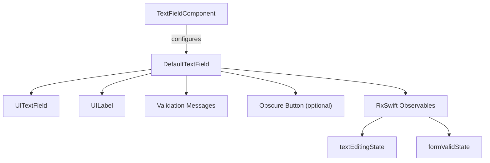

# DefaultTextField

A customizable, RxSwift-powered text field component for iOS, supporting validation, obscured input (passwords), and live validation messages. Built with UIKit and designed for easy integration and extensibility.

---

## Features
- Customizable text field with title, placeholder, and validation messages
- Supports obscured (password) input with toggle
- Live validation feedback with custom rules
- RxSwift observables for text and validation state
- UIKit-based, iOS 13+

---

## Installation

Add to your `Package.swift`:

```swift
.package(url: "https://github.com/demolaf/DefaultTextField.git", exact: "1.0.0")
```

And add `DefaultTextField` as a dependency for your target.

> **Note:** Requires [RxSwift](https://github.com/ReactiveX/RxSwift) 6.9.0

---

## Usage

```swift
import DefaultTextField
import RxSwift

// Define validation rules
let notEmpty = FormValidator(message: "Field cannot be empty", validate: { input in !(input?.isEmpty ?? false) })

// Configure the text field component
let component = TextFieldComponent(
    title: "Email",
    hint: "Enter your email",
    keyboardType: .emailAddress,
    textContentType: .emailAddress,
    obscured: false,
    maintainsValidationMessages: false,
    showsIconValidationMessage: true,
    validateWhenEmpty: false,
    validations: [notEmpty]
)

// Create the DefaultTextField
let defaultTextField = DefaultTextField(textFieldComponent: component)

// Observe text and validation state
let disposeBag = DisposeBag()
defaultTextField.textEditingState
    .subscribe(onNext: { text in print("Current text: \(text ?? "")") })
    .disposed(by: disposeBag)
defaultTextField.formValidState
    .subscribe(onNext: { isValid in print("Is valid: \(isValid)") })
    .disposed(by: disposeBag)

// Add to your view hierarchy as a UIView
view.addSubview(defaultTextField)
// Set constraints as needed
```

---

## API

### `DefaultTextField`
- `init(textFieldComponent: TextFieldComponent)`
- `textEditingState: Observable<String?>` — emits text changes
- `formValidState: Observable<Bool>` — emits validation state
- `textValue: String?` — current text
- `formValidValue: Bool` — current validation state
- `revalidateIfNeeded()` — manually trigger validation

### `TextFieldComponent`
- `title: String` — label text
- `hint: String` — placeholder
- `keyboardType: UIKeyboardType`
- `textContentType: UITextContentType?`
- `islabelHidden: Bool` — hide label
- `enabled: Bool` — enable/disable field
- `obscured: Bool` — secure entry (password)
- `maintainsValidationMessages: Bool` — show messages for valid input
- `showsIconValidationMessage: Bool` — show icon with validation
- `validateWhenEmpty: Bool` — validate on empty
- `validations: [FormValidator]` — validation rules

### `FormValidator`
- `init(message: String, validate: @escaping (String?) -> Bool)`
- `message: String` — message to display
- `validate: (String?) -> Bool` — validation closure

---

## Architecture



---

## License

MIT
